# feature-recognition

# Feature recognition algorithm

The **Features recognition module** is designed for extracting relevant
anatomical features, such as eyes or eyebrows or lips contours, from the
3D models of CH collections. The algorithm is written in Matlab and
follows an extraction procedure based on a generalization of the
classical **Hough Transform (HT) technique**, as described in \[1, 2\].

The algorithm performs the whole extraction pipeline taking as **input**
a mesh in ply format, some technical (optional) parameters, and a
**family of curves** selected among the (currently) available atlas:

|Curve|Figure|
|--|--|
| Circumference | 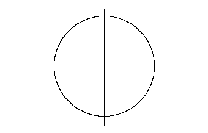 |
| Ellipse | 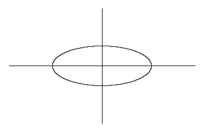 |
| Geometric Petal | 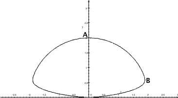 |
| Citrus  | 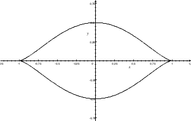 |
| D-convexities | 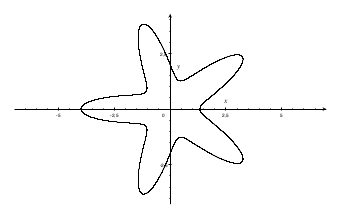 (D = 5) |
| Spiral | 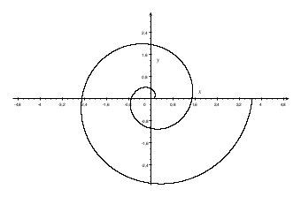 |

Besides the choice of the curve, the algorithm takes the following parameters:

- **D** is the number of convexities of the D-convexities curve
(default value is 8) or the degree of 'eccentricity' of the
geometric petal curve (default value is 40) - for the other curves this value
is not taken into account;
- **N**: positive integer number (less or equal to 60) used to
estimate the threshold of the clustering (default=50);
- **Minimum no. points per cluster**: minimum number of points
required from clustering to form a dense region (default=10);
- **Epsilon**: maximum admissible distance of the selected points
from the recognized curve (default=0.85);
- **Use Facets**: Restricts the feature extraction to the external facet. If the
facets are available, this option is activated by default;
- **Erosion**: number of layers to be deleted from the border of the facet (default=3).

As an option, the algorithm is able to support and to work on the input
model in .fct format, used for the faceting of fragments. In **output**,
for each identified feature, the algorithm returns: a list of vertices
indices, corresponding to the region of the identified feature, the
(horizontal and vertical) axes of the identified feature, and the
parameters associated to the best fitting curve.

The input and output formats of the algorithm are stable, whereas some changes
are still possible depending on the inclusion of new families of curves in the
currently available atlas.

Going into the operational details of the algorithm,
the **pipeline of the algorithm** can be sketched as
follows:

1. **Loading** of the mesh
   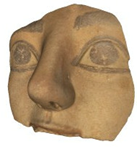
   using mean curvature
   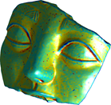
2. **Extraction** of the significant points
   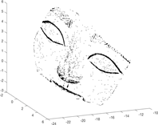
3. **Clustering** into connected components
   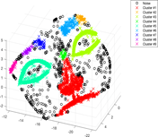
4. For each cluster:
   1.  **Projection** onto best fitting plane
        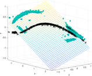
   2. **Alignment** using minimal bounding box
        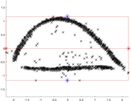
   3. **Curve detection** via generalization of the Hough Transform
        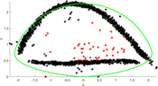
   4. **Localization** of the feature on the model
        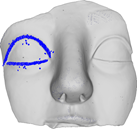

**References:**

\[1\] M. Torrente, S. Biasotti, B. Falcidieno, *Recognition of feature
curves on 3D shapes using an algebraic approach to Hough transforms*,
Pattern Recognition, Vol. 43, Supplement C (2018), pp. 111-130. ISSN:
0031-3203. DOI: 10.1016/j.patcog.2017.08.008.

\[2\] M. Torrente, S. Biasotti, B. Falcidieno, *Feature identification
in archaeological fragments using families of algebraic curves*, 14th
EUROGRAPHICS Workshop on Graphics and Cultural Heritage 2016, Genova,
Italy, 5-7 October 2016. Eurographics Digital Library.
