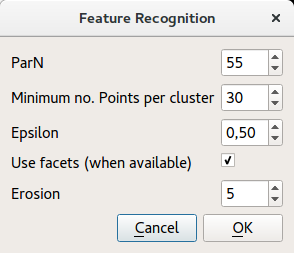
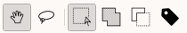

# fragment

# Fragment view

Note: For a general overview of the desktop client interface, go to the
[Overview](overview.md) page

This view extends the functionalities of the Inspection view, by
allowing some 3D model manipulation operations; in particular, it allows
to perform 3D part annotation, and automatic feature recognition.

In the Fragment View it is possible to load a model at once. To load a
model, right-click on an item in the Clipboard and select "Load
Artefact".

## Partonomy view

To load a partonomy, select the Load Vocabulary menu, then "Load
Cultural Heritage Artefact Partonomy". The Cultural Heritage Artefact
Partonomy (CHAP) is a controlled vocabulary of term, organized in a
hierarchical structure.

It is possible to annotate a part only with terms from this controlled
vocabulary. In future releases, other vocabularies will be made
available.

## Automatic Feature Recognition

The feature recognition tool uses a curve-based approach to detect some
salient features like eyes, based on the mean curvature of the 3D model.

After activating the Automatic Feature Recognition tool, a pop-up dialog
will open.

The following parameters can be set:

-   **ParN**: positive integer number (less or equal to 60) used to
    estimate the threshold for DBSCAN (default=50);
-   **Minimum cluster size**: minimum number of points required from
    DBSCAN to form a dense region (default=10);
-   **Epsilon**: maximum admissible distance of the selected points from
    the recognized curve (default=0.85);
-   **Use facets (when available)**: enable/disable the restriction of
    the feature recognition to the external facet of the artefact;
-   **Erosion**: shrinks the boundary of the external facet to exclude
    high curvature points on the boundary, which may give undesirable
    results. This is the number of the triangle loops to be removed from
    the selection (default=3).

After setting the algorithm parameters and pressing OK, the algorithm
will be run on the platform back-end on the corresponding 3D model.

Warning: for performance reasons, it is suggested to run this algorithm
on models of 100K vertices at most. A 100K vertices model takes about 2
minutes to be processed, but it depends on several factors (mainly, the
size and number of the clusters).

## Annotation

Once a 3D model has been loaded in the Fragment view, it is possible to
annotate it by pressing the Annotation Mode button in the main toolbar.
The annotations already made on an object will be loaded; it is possible
to switch off the annotation mode by pressing the button again. While in
annotation mode, the buttons in the annotation toolbar (fig.1) will be
enabled.

Manual selection is made with a tool called lasso, which allows to
select a free-form region on the surface of the object.

-   Move tool: this is the standard interaction modality, where the user
    can rotate, move or zoom the object
-   Lasso tool: this is the tool used to perform the selection, By
    clicking with the left mouse button and dragging, a free-form
    polygon can be drawn. The selection will have the shape defined by
    the polygon.

The subsequent three buttons change the behaviour of the lasso tool:

-   Simple selection: if an area has been already selected, it will be
    replaced
-   Add selection: the current selection will be joined with the new
    selection
-   Subtract selection: triangles belonging to the current selection
    will be removed according to the new selection

Finally, the Annotate button saves the annotation to the system.

The steps required to annotate an object are the following:

1.  Select a region of interest on the surface, using the Lasso tool
2.  Load a vocabulary of terms with the Load Vocabulary tool
3.  Select an entry from the vocabulary
4.  Press the Annotate button
5.  A window to select the color of the annotation will be displayed.
    Once a color has been chosen, press OK to save the annotation
