# geom-char

# Geometric characterization

## Visualize area and volume

The use can visualize area and volume of the object, as a textual overlay on the
3D canvas.

The 3D model area is approximated as the sum of the area of the mesh triangles.

The volume is computed as the volume of the close triangle mesh T obtained
virtually closing the mesh boundaries. The algorithm for volume computation
approximates the formula

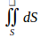

where S represents a surface with the formula

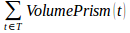

where VolumePrism represents the signed volume of the prism under a triangle t.
The signed VolumePrism is positive if the scalar product \<normal(t) , z\> is
positive (normal(t) is the unit vector that represents the normal to the
triangle t), 0 if \<normal(t), z\> is 0, negative otherwise.

## Minimal Bounding Box

It represents the minimal oriented bounding box of a fragment, intuitively it is
the smallest box that packs the model. It gives an idea of the size of the
model; it could be used to group fragments with similar dimensions

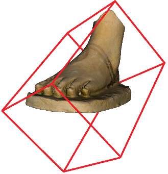 <!-- {width="144" height="149"} -->
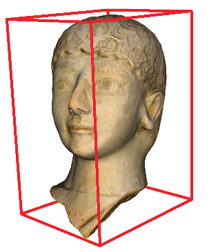 <!-- {width="124" height="159"} -->

It has been evaluated using MathGeoLib, an online C library, based on an exact
algorithm <https://github.com/juj/MathGeoLib>, under Apache 2 license.

## Shape Diameter Function (SDF)

The shape diameter function approximates the diameter of the object in each
point, following a direction which is normal to the surface (see green lines in
the Figure below, left image). Intuitively it gives a good approximation of the
thickness on sherd-like fragments (Figure below, right images, colours range
from yellow to red).

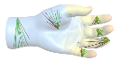

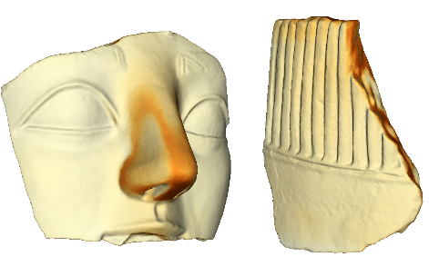 <!-- {width="225" height="135"} -->

The SDF computation is based on the `sdf_value()` function of the CGAL
Triangulated Surface Mesh Segmentation Toolbox that implements \[1\].

\[1\] L.Shapira, A.Shamir, and D.Cohen-Or. *Consistent mesh partitioning and
skeletonisation using the shape diameter function*, The Visual Computer,
24(4):249--259, 2008..

## CIELAB L-channel from RGB values

The CIELAB colour space approximates human vision in a good way \[2\]. In such a
space, tones and colours are distinct: the L channel is used for the luminosity,
which closely matches the human perception of light (L = 0 yields black and L =
100 yields di use white), whereas the a and b channels specify colours \[3\].

[We are highlighting the L-channel values in the vertices, to enhance some
colorimetric features, making them easier to be identified. In the Figure below,
colors range from black (L-channel value = 0) to white (L-channel value=100).]

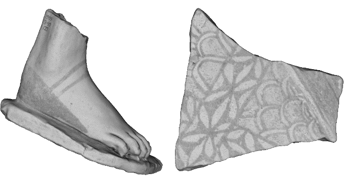

\[2\] E. Albuz, E. D. Kocalar, A. A. Khokhar, _Quantized CIELAB* space and
encoded spatial structure for scalable indexing of large color image archives_,
in: Acoustics, Speech, and Signal Processing, Vol. 6, 2000, pp. 1995--1998.

\[3\] R. W. G. Hunt, M. R. Pointer, *Measuring Colour*, Fourth Edition, Wiley,
2011.

## Curvatures of a surface

The concept of curvature is adopted to locally characterize bumps and hollows on
a surface.

Geometrically, the curvature of a curve in a regular point is defined as the
inverse of the radius of the osculating circle passing through this point,
where, informally, by the osculating circle we mean the circle that fits the
curve on a region infinitesimally small around that point. The extension of the
concept of curvature to a surface \f$ \Sigma \f$ is introduced through the
notion of normal plane in a point. The intersection between the normal plane and
\f$ \Sigma \f$ defines an intersection curve \f$ \xi \f$ where the curvature \f$
\kappa \f$ in the point x is well defined (and it is called normal curvature),
see details in Figure below. There are infinite intersection curves in a point
x; however, the normal curvature assumes a minimum and a maximum value, denoted
\f$ k_1 \f$ and \f$ k_2 \f$, respectively. \f$ k_1 \f$ and \f$ k_2 \f$ are
called principal curvatures of the surface in a point (\f$ k_1 \f$ ≥ \f$ k_2
\f$).

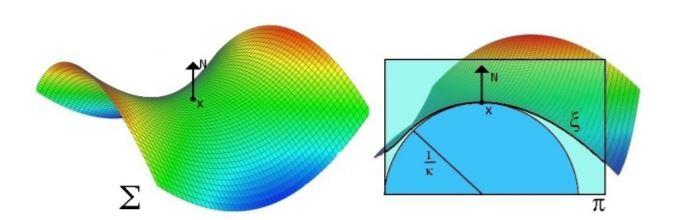

Representation of the normal curvature to the surface \f$ \Sigma \f$ in a point
x. The oriented vector N represents the normal vector in x. On the right, the
surface is sectioned along the plane \f$ \pi \f$ that generates the curve \f$
\xi \f$. The radius of the osculating circle in x relative to \f$ \pi \f$
determines the normal curvature.

Max and min curvatures (\f$ k_1 \f$ and \f$ k_2 \f$) are evaluated with the
Toolbox Graph for MATLAB (available on MathWorks, File Exchange).

## Mean curvature

Given the max and min curvature, the mean curvature in a vertex of a triangle
mesh is defined as 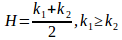.

The mean curvature is useful to highlight convexities and concavities of the
fragments surface (in the Figure below, the mean curvature is shown ranging
colours from blue (concave) through yellow (almost flat) to red (convex)
vertices.

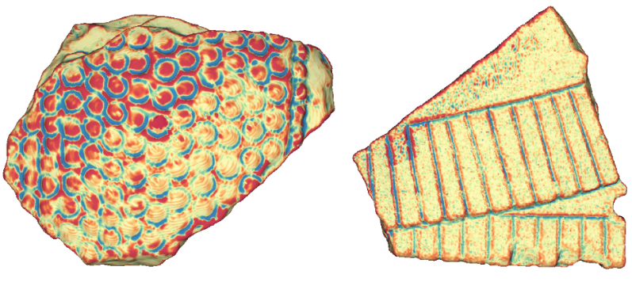

## Shape Index

The shape index \[4\] is an alternate way of combining surface curvatures,
defined as follows.

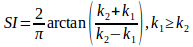

The shape index scale ranges from -1 to 1, see Figure below. There we show the
range of shape index values and the type of curvature which they represent. The
shape index values are encoded as a continuous range of colours from blue (-1)
to red (1).

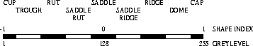

In the context of GRAVITATE, the shape index seems useful to highlight the
production technique in the internal facet, see Figure below.

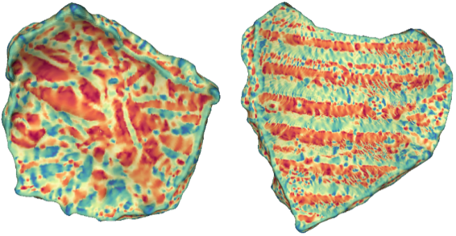

\[4\]J. J. Koenderink, A. J. van Doorn, *Surface shape and curvature scales*,
Image and Vision Computing 10 (8) (1992) 557 -- 564.
