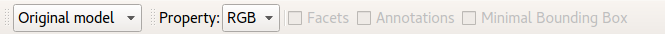

# inspection

# Inspection View

Note: For a general overview of the desktop client interface, go to the
[Overview](overview.md) page

The Inspection View is the initial view of the GRAVITATE desktop client.

This view allows the user to visualize one or more artefacts in
parallel. For each artefact, the system displays its 3D model and
metadata.

To load an artefact in the Inspection View, right-click an object in the
Clipboard and press "Load Artefact".

You can load multiple models in this panel, and compare them side by
side.

Tools:

-   **Data** Menu: it contains options for loading artefacts in the
    Clipboard.
-   **Datasets**: allows the choice of possible datasets from a list
    (currently unavailable);
-   **Browse**: opens up a dialog window where several predefined
    collections can be browsed, and then added to the clipboard. This
    functionality is at a very early stage, and its usability will be
    improved in a future release.
-   **Geometric Characterization** menu: this family of tools loads and
    visualizes pre-computed scalar field properties. The following
    properties are supported:
    -   Mean Curvature
    -   Shape Index
    -   Lightness channel in the CIELAB colour space
    -   Shape Diameter Function

    For more information about the geometric properties, go to the
    [Geometric Characterization](geometric-characterization.md) page.
-   **Load facets** tool: loads and visualizes the facets in which the
    model has been segmented. For more information about the facets, go
    to the [Faceting](faceting.md) page
-   **Load Annotations** tool: visualizes the part-based annotations
    made on the 3D model, in read-only mode. For more information about
    the annotation functionality, go to the [Fragment View](fragment.md) help page.

In the upper part of the inspection panel, there is a toolbar with
several controls:

The first drop-down list controls the 3D model resolution. The possible
versions are original model (the original scan), Full resolution (a
cleaned model with the same resolution, but currently without color
information) and three simplified versions: 1 Million vertices, 100K
vertices, 50K vertices. The user can change resolution of the 3D model
at any time, and it will be propagated to all the artefacts currently
loaded.

The **Property** selector allows to change the active geometric
property. The RGB color is set by default, while other properties will
be available when loaded.

Facets, Minimal Bounding Box and Annotations checkboxes enable and
disable the corresponding visualizations.
