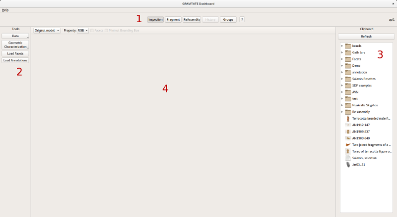

# overview

# Overview

The user interface is made of different views. Each view offers a
different way to interact with the repositories and the object contained
in them. Some views offer 3D functionalities (e.g. Inspection, Fragment,
ReAssembly), others do not (History, Groups).

1.  **View selection bar**: this is where the user selects the current
    view. When clicking on a view, the panels, tabs and menus will
    change their content accordingly. The active view is highlighted;
2.  **Tools**: each view will have different tools. Each tool is
    represented by a button. These tools can be used on the items found
    in the main area or the selection panel. In some cases, tools are
    grouped together, so that clicking on a button will open a sub-menu
    rather than perform directly an action (e.g. the Detect button in
    the Fragment view);
3.  **Clipboard**: this area contains a selection of items from the
    repositories. It is maintained when changing views. Items added in
    the Clipboard from the web interface will be kept in sync with the
    desktop interface. The user can add, remove items, Clicking with the
    right mouse button on an item will open a context menu;
4.  **Main area**: this is the area where the actual work happens. For
    some views, this area will be 2D, while for other views it will be
    3D.

## 3D visualization panel

The 3D visualization panel provides basic graphical interaction
functionalities, such as rotating/zooming around the object, and
changing mesh visualization modality (solid, wireframe or points).

![3d-visualization]

The lighting configuration can be changed by clicking the lightbulb icon.

![light-tool]

This can be useful to see more
clearly the incisions on the surface. There are four different
configurations for the lights.

There are also two tools that can be used to perform measurements on the
3D model: the *value picker* and the *distance measurement* tools.

### Value picker Tool

This tool allows to
get the value of a certain geometric property in a specific point.
This tool will give results only when a geometric property has been
loaded and set as active (Mean Curvature, Shape Index, Lightness or
SDF). After clicking on the tool, move the mouse on the 3D model to
read the corresponding value. A left click with the mouse will fix
the value in a specific point (marked with a green dot).

![picker-tool]

### Distance measurement Tool

This tool allows to measure the distance between two arbitrary points on the
mesh surface.

![distance-tool]

[3d-visualization]: images/image4.png
[light-tool]: images/tool-change-light.png
[picker-tool]: images/image2.png
[distance-tool]: images/image6.png
[overview]: images/overview.png
